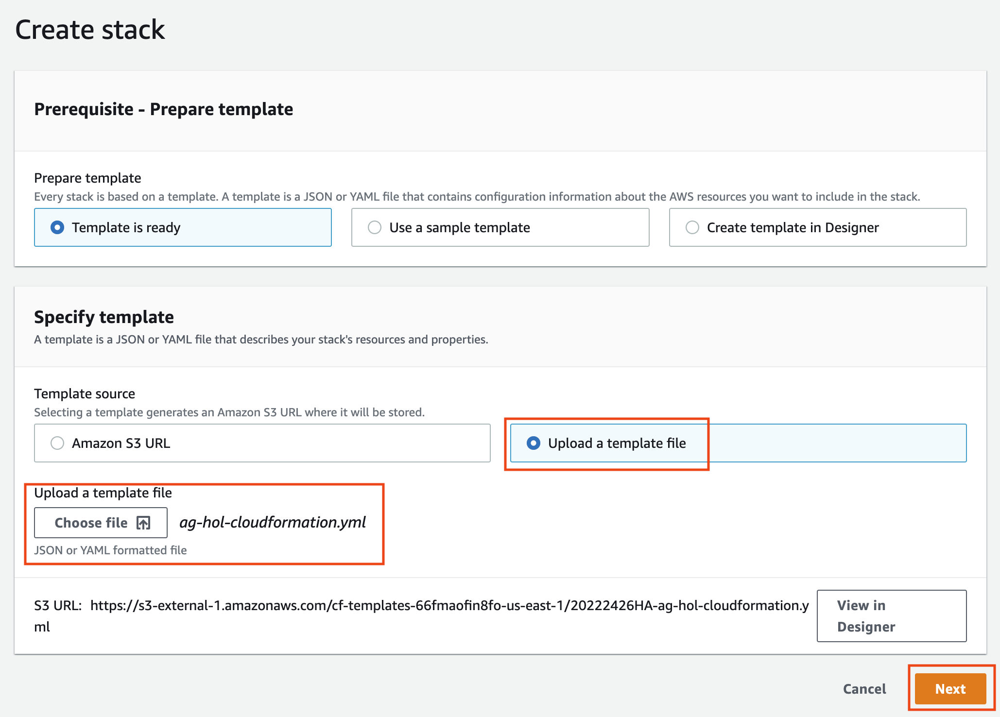
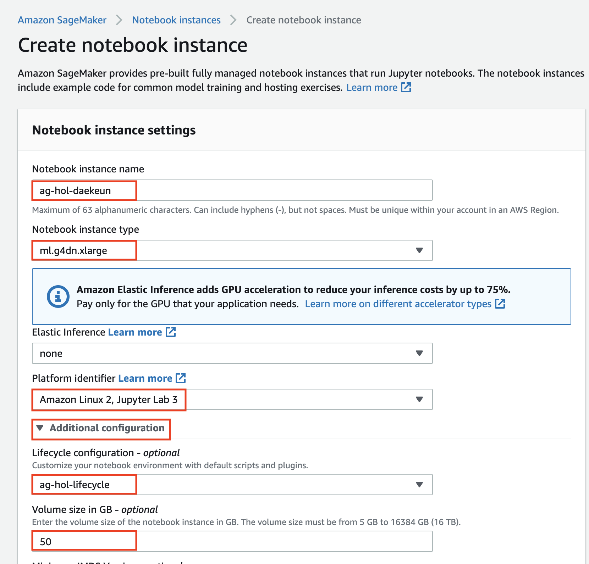

# Setup
본 핸즈온을 수행하기 위해서는 AWS CloudFormation 설정(Option 1)이나 수동 환경 설정(Option 2)이 필요합니다.

 

## Option 1. AWS CloudFormation 환경 설정

본 핸즈온랩에 필요한 AWS 리소스를 생성하기 위해 CloudFormation 스택이 제공됩니다. 아래 링크를 선택하면 스택이 시작될 AWS 콘솔의 CloudFormation 으로 자동 redirection 됩니다.
- <a href="https://console.aws.amazon.com/cloudformation/home?region=ap-northeast-2#/stacks/create/review?stackName=AIMLWorkshop&amp;templateURL=https://daekeun-workshop-public-material.s3.ap-northeast-2.amazonaws.com/cloudformation/ag-hol-cloudformation.yaml">Launch CloudFormation stack in ap-northeast-2 (Seoul)</a>
- <a href="https://console.aws.amazon.com/cloudformation/home?region=us-east-1#/stacks/create/review?stackName=AIMLWorkshop&amp;templateURL=https://daekeun-workshop-public-material.s3.ap-northeast-2.amazonaws.com/cloudformation/ag-hol-cloudformation.yaml">Launch CloudFormation stack in us-east-1 (N. Virginia)</a>

CloudFormation 스택은 아래 리소스를 자동으로 생성합니다.
- EC2 및 SageMaker 인스턴스에 퍼블릭 서브넷 + 보안 그룹이 있는 VPC
- AWS 리소스에 액세스하는 데 필요한 IAM role
- Jupyter 노트북에서 모델을 정의하는 SageMaker 노트북 인스턴스. 모델 자체는 SageMaker 서비스를 사용하여 학습됩니다.
- SageMaker에 필요한 S3 버킷

AWS CloudFormation 콘솔의 Quick create stack 페이지로 리디렉션된 후 다음 단계를 수행하여 스택을 시작합니다.
- MLInstanceType: SageMaker notebook instance type을 선택합니다. 미리 설정된 <strong><em>`ml.m4.xlarge`</em></strong>를 사용하셔도 되지만, 만약 충분한 크레딧이 있다면 <strong><em>`ml.p2.xlarge`</em></strong>를 선택하십시오.
- Capabilities 에서 <strong><em>`I acknowledge that AWS CloudFormation might create IAM resources`</em></strong>을 체크합니다.
- 우측 하단의 `Create stack` 버튼을 누르고, 스택 생성이 완료될 때까지 기다립니다. 약 10분이 소요됩니다.
  

**
Figure 1-1. Create an CloudFormation stack
**     

**
Figure 1-2. Stack 생성 중
**     

 

## Option 2. 수동 환경 설정

### Lifecycle Configuration 생성
1. AWS 관리 콘솔(Management Console) 화면의 **AWS Services 리스트**에서 Amazon SageMaker 서비스를 선택합니다.
    
    **
Figure 2-1. AWS Management Console
**      

1. Lifecycle Configuration를 생성하기 위해 왼쪽 패널 메뉴 중 `Lifecycle configurations` 을 선택 후, 오른쪽 상단의 `Create configuration` 버튼을 클릭합니다.
    
    **
Figure 2-2. Lifecycle configuration
**     

1. Name 항목에 `ag-hol-lifecycle` 을 입력하고 <a href="https://raw.githubusercontent.com/daekeun-ml/autogluon-on-aws/main/0.setup/ag-hol-lifecycle-sh" download target="_blank">Lifecycle Configuration Script</a>를 클릭하여 다운로드합니다. 
다운로드가 완료되었으면 `ag-hol-lifecycle.sh` 의 내용을 복사하여 Script 항목에 붙여넣기한 후, 오른쪽 하단의 `Create configuration` 버튼을 클릭합니다. 
    
    **
Figure 2-3. Create lifecycle configuration
**     

### Notebook instance 생성

1. 새로운 Notebook instance를 생성하기 위해 왼쪽 패널 메뉴 중 Notebook Instances 선택 후 오른쪽 상단의 `Create notebook instance` 버튼을 클릭합니다.
    
    **
Figure 2-4. Create notebook instance
** 

1. **Notebook instance settings** 항목에서 Notebook instance name애 `ag-hol-[YOUR-NAME]` 을 입력하고, Notebook instance type에 `ml.p2.xlarge` 인스턴스 타입을 선택합니다. 그런 다음, **Additional configuration** 을 클릭하여 Lifecycle configuration - optional 항목에 `ag-hol-lifecycle` 을 입력합니다.
    
    **
Figure 2-5. Notebook instance settings
**     

1. IAM role은 `Create a new role` 을 선택하고, 생성된 팝업 창에서 `S3 buckets you specify – optional` 밑의 `Any S3 bucket` 을 선택합니다. 그 이후 `Create role` 을 클릭합니다.
    
    **
Figure 2-6. Create an IAM role
**     

1. 다시 Create Notebook instance 페이지로 돌아온 뒤 `Create notebook instance` 를 클릭합니다.

### Notebook Instance 접근하기

1. 서버 상태가 `InService` 로 바뀔 때까지 기다립니다. 보통 5분 정도의 시간이 소요 됩니다. 

1. (Optional) 노트북 인스턴스가 생성되는 동안 Lifecycle configuration이 정상적으로 동작하는지 CloudWatch로 확인해 봅니다. 이 과정은 필수가 아니기에 선택적으로 수행하시면 됩니다.

1. `Open Jupyter`나 `Open JupyterLab`을 클릭하여 방금 생성한 notebook instance의 개발 환경으로 접속합니다.

수고하셨습니다. 